# 25 Most Recommended Travel Booking Platforms in 2025

Booking travel shouldn't feel like navigating a maze where one site shows a hotel for $150, another says $200, and the hotel's own website quotes $175—all for the same room on the same night. Whether you're planning a solo backpacking trip through Southeast Asia, coordinating a family reunion that needs five hotel rooms, or just trying to find a decent flight that doesn't cost more than your rent, the right travel booking platform saves you hours of comparison shopping and hundreds of dollars that could go toward actually enjoying your trip.

The online travel booking landscape has evolved from simple fare aggregators into sophisticated ecosystems offering everything from AI-powered price prediction to last-minute hotel deals, vacation rental marketplaces, and bundled packages that actually save money. Smart travelers now stack multiple platforms—using metasearch engines to find the best base price, loyalty programs to earn free nights, and booking flexibility to handle the inevitable itinerary changes that come with real-world travel.

## **[Trip.com](https://trip.com)**

Global travel platform combining flights, hotels, trains, car rentals, and activities with strong Asia-Pacific coverage and 24/7 customer support.

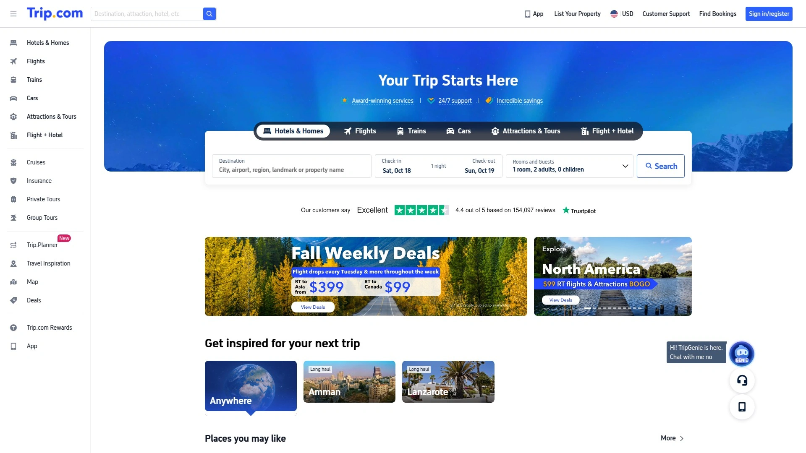

Trip.com operates as a comprehensive one-stop booking solution covering virtually every travel component you need—flights across hundreds of airlines, hotels from budget hostels to luxury resorts, high-speed train tickets in multiple countries, car rentals, airport transfers, and attraction tickets all bookable through one interface. The platform's roots in Asia give it particularly strong inventory and competitive pricing throughout China, Southeast Asia, Japan, and the broader Asia-Pacific region, often beating Western competitors on Asian routes and accommodations.

The customer support infrastructure stands out with claims of answering phone calls within approximately 30 seconds, providing reassurance for travelers dealing with booking issues, cancellations, or itinerary changes across time zones. Secure payment processing uses industry-standard encryption, and the platform supports multiple currencies and languages making it accessible for international travelers.

Trip.Best Awards highlight destinations, hotels, and experiences based on traveler data and reviews. The recommendations section features curated content for popular destinations like Shanghai, Hong Kong, Bangkok, Singapore, Dubai, Las Vegas, and major European cities. For train travel enthusiasts, the platform handles China's complex high-speed rail booking system plus European and Korean train networks, simplifying what can otherwise be frustrating reservation processes.

The mobile app extends functionality to on-the-go booking and itinerary management. Package deals combining flights and hotels offer bundle discounts similar to other major OTAs. For travelers whose itineraries include significant Asia-Pacific destinations or who value having train, flight, and hotel bookings managed through unified customer service, Trip.com delivers inventory breadth and regional expertise that purely Western platforms sometimes lack.

## **[Booking.com](https://booking.com)**

Market-leading hotel booking platform with 4.4-star rating, free cancellation on most properties, and loyalty discounts for repeat users.

Booking.com dominates the hotel booking space through sheer inventory—millions of properties worldwide spanning hotels, apartments, hostels, vacation rentals, and unique stays. The platform consistently scores highest in user satisfaction studies, earning 4.4 out of 5 stars compared to competitors like Expedia at 2.6 stars according to analysis of thousands of app reviews. Users praise the easy-to-find properties, simple booking process, and reliable interface that consistently outperforms alternatives.

Free cancellation availability on most bookings provides flexibility for travelers whose plans shift—book early to secure availability, then cancel without penalty if circumstances change. The Genius loyalty program rewards frequent bookers with discounts up to 15% on participating properties, free room upgrades, and priority customer service. No complicated points systems or elite status requirements—just book 10 nights and unlock benefits.

The mobile app receives particular acclaim for speed and stability, with significantly fewer bugs and crashes than competitors. Search filters cover every conceivable preference—price ranges, guest ratings, amenities, neighborhoods, property types, and more. Map views show exactly where hotels sit relative to attractions and transportation. Guest reviews number in the millions, providing genuinely helpful insights into what properties actually deliver versus what marketing photos promise.

Customer support responsiveness exceeds competitors according to user feedback, though like all OTAs, issues can still arise. Pricing transparency shows total costs including taxes and fees upfront, unlike some competitors that reveal full prices only at checkout. The platform's global reach means strong inventory everywhere from major Western cities to remote Asian villages, though prices in Asia sometimes trail specialized regional platforms like Agoda by small margins.

## **[Expedia](https://expedia.com)**

Full-service travel booking site offering vacation packages, One Key rewards program, and potential savings up to 30% on hotel-flight bundles.

Expedia pioneered the online travel agency model and maintains comprehensive inventory across flights, hotels, car rentals, cruises, and vacation packages. The One Key rewards program replaced previous loyalty schemes, offering 0.2% cash back on flight bookings that stacks with airline miles and credit card rewards. More valuable than the modest cash back are the elite status tiers unlocking up to 20% savings on hotels, property upgrades, priority support, and price drop protection as you climb levels.

Package deals bundling flights with hotels can deliver genuine savings—Expedia claims up to 30% off when combining bookings, though actual discounts vary by destination and dates. The bundling approach works well for travelers wanting simplified trip planning with one confirmation rather than juggling separate airline and hotel reservations. Vacation package options include pre-built itineraries to popular destinations plus customizable multi-city trips.

Hotel experiences receive positive feedback from Expedia users, with reviews highlighting excellent locations, comfortable rooms, and quality amenities. The booking interface provides straightforward searching and filtering, though some users report the app experiences more technical issues than competitors—crashes, slow loading, and bugs appear more frequently in user reviews.

Customer support feedback skews more negative compared to Booking.com, with users reporting longer response times and less satisfactory issue resolution. Pricing can be competitive, though side-by-side comparisons often show Booking.com or direct hotel bookings matching or beating Expedia rates. The platform works best for travelers prioritizing package deals, using the One Key program actively, or those who've had consistently positive experiences with Expedia's service.

## **[Agoda](https://agoda.com)**

Asia-focused booking platform owned by Booking Holdings offering consistently low rates in Asian markets with Agoda Cash rebate rewards.

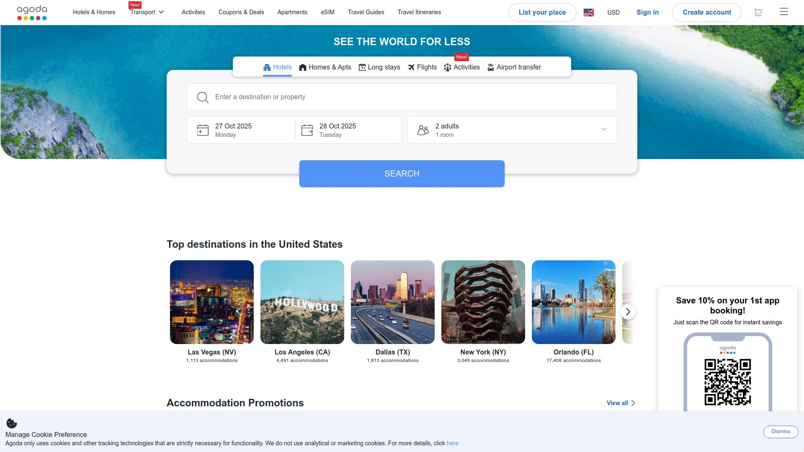

Agoda specializes in Asian and Pacific destinations, leveraging Southeast Asian roots to deliver rates that frequently undercut Western competitors throughout Thailand, Japan, Indonesia, Singapore, and the broader region. Secret Deals and member-only discounts provide additional savings for logged-in users. The platform lists over 2 million properties globally with particular strength in Asia where inventory and pricing expertise create competitive advantages.

The Agoda Cash rebate program credits accounts after completed bookings, functioning as store credit applicable to future reservations. Flash sales and app-exclusive pricing generate periodic deep discounts. The search interface includes robust filtering and map features helping travelers narrow options efficiently. While not offering traditional loyalty status tiers, the consistent discounts and cash-back approach appeals to price-focused travelers.

Customer service quality receives mixed reviews, with particularly strong support within Asia but less consistent responsiveness outside the region. Some travelers report issues with booking confirmation and cancellation processing. The platform shares ownership with Booking.com under Booking Holdings, meaning some properties appear on both sites at different prices—always cross-check rates across platforms.

For travel throughout Asia, Agoda often delivers the best value among major booking platforms. Price comparison tools like Google Hotels or Trivago help verify whether Agoda's rate truly beats alternatives for specific properties. Independent testing found Agoda offered the cheapest rates 34% of the time globally, outpacing competitors. Western destination bookings should be compared against other platforms as Agoda's advantages diminish outside its core markets.

## **[Hotels.com](https://hotels.com)**

Straightforward booking platform with simple loyalty program offering one free night for every 10 nights booked through the site.

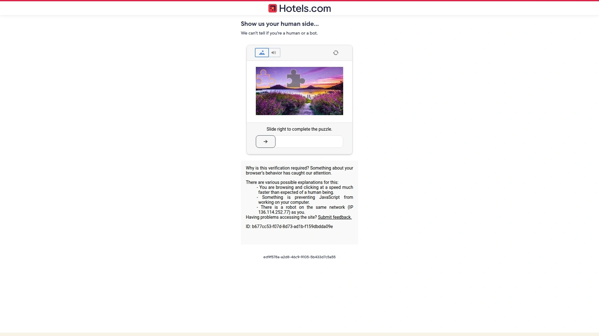

Hotels.com distinguishes itself through a remarkably simple loyalty proposition—stay 10 nights, get one free. No complex points calculations, no elite status requirements, no confusion about redemption values. Book 10 hotel nights at any price point through Hotels.com, then receive one free night valued at the average nightly rate of those 10 stays. The transparent structure appeals to travelers tired of complicated rewards programs.

Member Prices and secret deals appear for logged-in users, lowering nightly rates beyond public pricing. The interface emphasizes ease of use with strong filtering for amenities, guest ratings, and neighborhood selection. Many properties offer free cancellation and flexible booking terms. The platform lists millions of properties globally, covering everything from budget motels to luxury resorts.

The catch: loyalty nights don't count if you apply coupons or promo codes to bookings. This limitation frustrates deal hunters who find promotional codes but must choose between immediate discounts or loyalty progress. The program lacks elite perks and hotel status recognition that full hotel loyalty programs provide—no room upgrades, no late checkout, no bonus amenities.

Base pricing doesn't always match the absolute lowest available rate—comparison shopping often reveals Booking.com or direct bookings beating Hotels.com prices. The loyalty benefit accumulates value over time, particularly for frequent travelers who book 10+ nights annually. Calculate whether the free night value exceeds potential savings from booking cheaper alternatives elsewhere. For travelers wanting straightforward rewards without status complexity, Hotels.com delivers transparent value that's easy to understand and use.

## **[Priceline](https://priceline.com)**

Express Deals specialist offering opaque bookings hiding hotel details until confirmation, plus 200% price difference refunds on Express Deals.

Priceline pioneered opaque booking through Express Deals—prepaid, non-refundable reservations where the exact hotel remains hidden until after purchase completion. You see the neighborhood, star rating, amenities, and TripAdvisor reviews, but not the specific property. These mystery bookings deliver deep discounts for travelers with flexible preferences willing to accept uncertainty for savings.

The generous best-price guarantee on Express Deals refunds 200% of price differences if you find identical bookings cheaper elsewhere anytime until midnight before travel. Regular bookings get 24-hour price matching at 100% refund rates. Pricebreakers offer middle-ground approach showing three hotel options before booking—you're guaranteed one of the three shown, adding some certainty to opaque bookings.

Priceline VIP loyalty program provides four membership tiers with perks including best price guarantees, hotel discounts, and Express Deal coupons. The free program rewards booking frequency with escalating benefits. Standard hotel bookings work like any OTA—search, compare, book specific properties at transparent prices.

The model works brilliantly for travelers whose plans are concrete and hotel specifics matter less than location and price. Business travelers, families with non-negotiable dates, and anyone needing specific amenities should avoid Express Deals and book traditionally. Testing found Priceline offered competitive rates 23% of the time globally. The opaque booking approach creates legitimate savings opportunities that transparent bookings can't match, but only for travelers comfortable with uncertainty.

## **[Airbnb](https://airbnb.com)**

Vacation rental marketplace connecting travelers with hosts offering entire homes, private rooms, and unique stays worldwide.

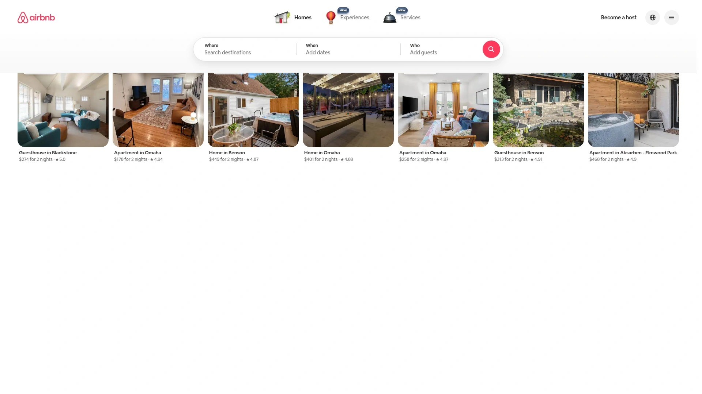

Airbnb revolutionized vacation rentals by enabling property owners to list entire homes, spare bedrooms, unique accommodations like treehouses and yurts, and experiences hosted by locals. The peer-to-peer model creates inventory diversity impossible through traditional hotels—rent a Parisian apartment for authentic living, book a countryside villa for family gatherings, or find budget rooms in expensive cities.

The platform emphasizes individual listings with personality, detailed photos, host profiles, and genuine guest reviews creating transparency about what to expect. Communication tools connect guests and hosts directly for questions, special requests, and local recommendations. Flexible search filters sort by property type, amenities, neighborhood, price, and more. Many listings allow longer stays with monthly discounts attractive to digital nomads and remote workers.

Cancellation policies vary by host from flexible to strict, requiring careful review before booking. Cleaning fees and service charges increase total costs beyond nightly rates—always review full price breakdowns. Quality varies dramatically between listings, making reviews and ratings crucial for avoiding disappointing properties. The company added enhanced cleaning protocols, though standards depend on individual host compliance.

Airbnb works exceptionally well for group travel needing multiple bedrooms, travelers wanting kitchen access to save on dining costs, and those seeking authentic local living experiences rather than hotel standardization. Solo travelers and couples might find traditional hotels more cost-effective and convenient. Urban apartments often beat hotel prices in expensive cities, while rural and vacation destination pricing varies widely.

## **[Vrbo](https://vrbo.com)**

Vacation rental platform emphasizing whole-property rentals ideal for families, with 2+ million listings averaging six-guest capacity.

Vrbo focuses specifically on entire properties rather than shared spaces, making it particularly suitable for family travel. The platform lists over 2 million vacation rentals worldwide with 70% including two or more bedrooms and average capacity for six guests. Properties skew toward larger homes in non-urban destinations—beach houses, mountain cabins, lakefront cottages, and suburban family homes dominate inventory.

Owned by Expedia Group, Vrbo shares infrastructure and many properties with sister brand HomeAway, though Vrbo maintains stronger brand recognition in most markets. The platforms share identical cancellation policies, COVID-19 protocols, and booking processes. Search filters include family-friendly recommendations, nearby activities like hiking and winery tours, property types, amenities, and cleanliness ratings.

Eighty-seven percent of Vrbo guests travel with family according to internal surveys, reflecting the platform's positioning. Properties tend to accommodate longer stays compared to Airbnb's mix of short urban bookings and extended rentals. The platform emphasizes cleanliness through dedicated filters showing highly-rated properties, detailed cleaning practices, buffer windows between guests, and check-in policies minimizing contact.

Customer support operates 24/7 for booking issues and cancellations. Vrbo's focus on whole properties eliminates concerns about shared spaces, host presence, or privacy that sometimes arise with Airbnb. Pricing typically runs higher than Airbnb for comparable properties, reflecting the emphasis on larger homes and family-oriented inventory. For groups needing substantial space and family-friendly environments, Vrbo's curated inventory simplifies finding appropriate accommodations.

## **[Skyscanner](https://skyscanner.com)**

Flight metasearch engine with flexible search options showing prices to "anywhere" plus hotels and car rentals for comprehensive trip planning.

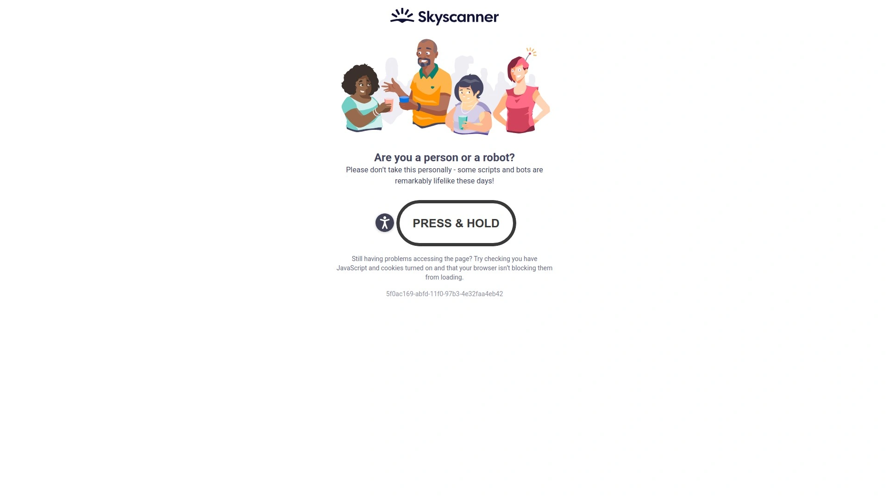

Skyscanner excels at flexible flight searching for travelers prioritizing budget and adventure over specific destinations. The "Search Anywhere" feature shows cheapest flights from your location to all destinations, perfect for spontaneous travelers choosing destinations based on price. The platform compares hundreds of airlines and booking sites simultaneously, aggregating options into sortable results.

Clean interface design and mobile app functionality earn consistent praise. Price alerts notify users when fares drop for monitored routes. The platform supports multiple languages and currencies, making it accessible globally. Results integrate traveler reviews, fare insights, and alternative nearby airports that might offer cheaper options.

Skyscanner functions as a metasearch engine rather than booking directly—clicking results redirects to airline websites or OTAs for transaction completion. This structure means you're comparing comprehensive options but booking elsewhere. Hotels and car rental search extends functionality beyond just flights, though Skyscanner's reputation centers on flight searching capabilities.

The international appeal and flexible search philosophy make Skyscanner particularly popular with backpackers, budget travelers, and anyone open to destination flexibility. Fixed itinerary travelers benefit less from the "anywhere" features but still appreciate comprehensive price comparison. For maximum savings, use Skyscanner alongside Google Flights—each occasionally finds deals the other misses.

## **[Google Flights](https://google.com/travel/flights)**

Powerful flight search engine with pricing graphs, calendar views, and AI-powered predictions for delays and price changes.

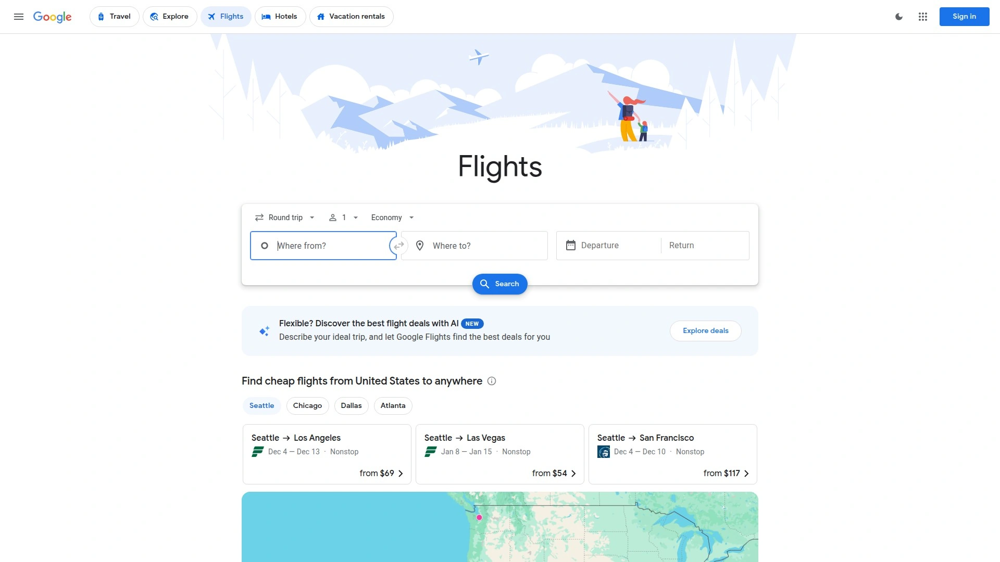

Google Flights leverages Google's massive data access and algorithm capabilities to deliver lightning-fast flight searching with sophisticated visualization tools. The pricing calendar displays two months of availability simultaneously with cheapest dates highlighted in green, making flexible date searching effortless. Suggestions like "save $50 by flying a day earlier" simplify decision-making through data-driven recommendations.

The platform doesn't sell flights directly but links to airlines and OTAs offering best fares. Integration with Gmail and Google Calendar automatically imports flight reservations and travel itineraries. AI features predict flight delays based on historical data, provide baggage fee insights, and calculate carbon emissions for environmentally conscious travelers.

Map exploration lets you set date ranges then browse regions to discover destination options and prices. This visual approach suits travelers with geographic flexibility wanting to explore possibilities. The interface emphasizes speed and simplicity—no cluttered pages or excessive options, just efficient searching.

Google Flights doesn't search smaller online travel agencies, potentially missing some deals. Best practice involves using Google Flights for initial searching and date optimization, then checking Kayak, Momondo, or Skyscanner to verify pricing against additional OTAs. The combination catches deals individual platforms miss. For travelers living in the Google ecosystem, the seamless integration and familiar interface make Google Flights a natural starting point.

## **[Kayak](https://kayak.com)**

Comprehensive travel metasearch engine finding flights, hotels, and car rentals with Explore tool helping discover destination options.

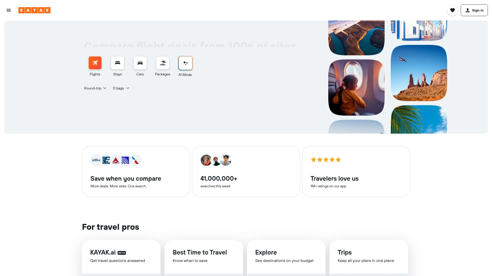

Kayak searches hundreds of websites and booking platforms simultaneously, aggregating travel options into comparable results. The streamlined process takes searchers directly from results to cheapest booking options with fewer clicks than some competitors. Flexible date search shows results from multiple days on one page, eliminating need to check each date separately.

Independent testing found Kayak discovering better deals than Google Flights—for example, finding $472 round-trip Los Angeles to Barcelona flights versus Google's $550 result. The platform manages sister sites Momondo and Cheapflights, so results often overlap between these Booking Holdings properties. The Explore tool helps travelers with flexible destinations discover options based on budget and preferences.

Coverage includes flights, hotels, car rentals, and vacation packages through one interface. Price prediction features forecast whether fares will rise or fall, helping time purchases. Hacker Fares combine one-way tickets on different airlines for savings over round-trip bookings. The interface balances comprehensive features with usability, though some find it slightly busier than Google Flights' minimalist approach.

Kayak functions as a metasearch engine redirecting to booking sites rather than processing transactions directly. The breadth of sources searched often uncovers deals that more limited platforms miss. For comprehensive comparison shopping across maximum booking sources, Kayak delivers thoroughness that justifies its complexity.

## **[Momondo](https://momondo.com)**

Travel metasearch platform known for finding competitive prices by searching 1000+ airlines and travel sites simultaneously.

Momondo operates as part of Kayak's network under Booking Holdings, sharing similar search infrastructure while maintaining distinct branding. The platform searches over 1000 airlines and travel sites, aggregating options into sortable results. Independent analyses occasionally find Momondo discovering unique deals that sister sites miss, making it worth checking alongside Kayak.

The interface emphasizes visual appeal with colorful design elements and intuitive layouts. Price comparison displays clearly show cost variations across dates, airlines, and booking sites. Flexible search options help travelers with open dates find optimal timing. The platform covers flights, hotels, and car rentals through unified search.

Momondo's reputation centers on international flight deals where the platform frequently identifies competitive pricing. The breadth of sources searched captures both major carriers and smaller regional airlines often excluded from other metasearch engines. Flight alerts notify users when prices drop for saved routes.

As a metasearch engine, Momondo redirects to booking sites for transaction completion rather than processing payments directly. The overlap with Kayak and Cheapflights means comparing all three sometimes yields identical results, though occasional variations justify checking multiple platforms. For international travel and maximum source coverage, Momondo delivers comprehensive comparison.

## **[Hotwire](https://hotwire.com)**

Discount travel site featuring Hot Rate hotels hiding property details until booking for savings plus vacation package deals.

Hotwire employs opaque booking through Hot Rate hotels—travelers see neighborhood, star rating, amenities, and TripAdvisor ratings but not the specific property until after booking completion. This uncertainty delivers discounts for flexible travelers willing to accept mystery accommodations. Previous guest reports show which hotels others received, providing some insight into likely options.

Vacation packages combining flights and hotels generate substantial savings—hundreds of dollars off compared to separate bookings according to platform marketing. The bundling approach suits travelers planning complete trips rather than just accommodation or transportation individually. Package search appears under dedicated Vacations tab.

Standard hotel bookings work like traditional OTAs without opaque elements for travelers wanting certainty. The platform doesn't display discounted member rates from hotel chains like Marriott and Hyatt, potentially causing missed savings for loyalty program members. Always compare Hotwire prices against direct hotel bookings, particularly when you hold elite status.

Hot Rate effectiveness depends entirely on flexibility—business travelers needing specific hotels or amenities should avoid opaque bookings. Leisure travelers with concrete dates but flexible property preferences find genuine value through mystery savings. The vacation package deals deliver measurable discounts making Hotwire worth checking for complete trip planning.

## **[Hopper](https://hopper.com)**

Mobile-only booking app with 95% accurate price predictions, color-coded price maps, and price freeze features locking rates.

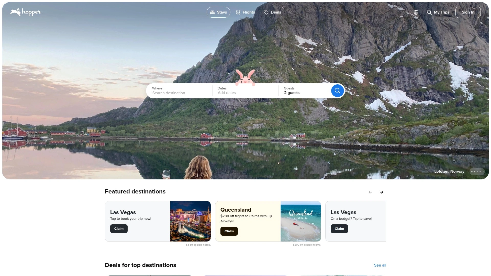

Hopper positions itself as the data science solution to booking timing, claiming 95% accuracy in price predictions. The color-coded map visualization shows cheapest and most expensive times for destinations at a glance—select cities, view pricing heatmaps, choose optimal dates based on budget. This visual approach simplifies the typically tedious process of checking multiple date combinations.

The unique price freeze feature lets travelers lock current rates for 12 hours to 21 days by paying small deposits later applied toward stays. If prices increase, you save up to $300. If prices drop, you pay the lower amount. This insurance against price volatility appeals to travelers watching rates fluctuate while finalizing plans.

Watch for automatically added Trip Extras including Hopper Tip and VIP Support—these fees add costs unless manually unchecked at booking. The mandatory nature of these default selections frustrates users who miss the fine print and pay unnecessary charges.

The mobile-only approach limits desktop users, a significant drawback for travelers preferring larger screens for trip planning. The app interfaces smoothly for smartphone users comfortable making travel decisions on mobile devices. Price prediction accuracy claims remain difficult to independently verify, though user reviews suggest the guidance generally proves reliable. For mobile-first travelers wanting data-driven booking timing recommendations, Hopper delivers specialized functionality unavailable elsewhere.

## **[TripAdvisor](https://tripadvisor.com)**

Review aggregator and travel planning site combining user reviews, photos, and booking capabilities for hotels, restaurants, and attractions.

TripAdvisor built its reputation on user-generated reviews and photos providing authentic perspectives on hotels, restaurants, tours, and attractions. Millions of reviews help travelers make informed decisions based on actual guest experiences rather than marketing materials. The platform aggregates opinions across diverse traveler types, revealing patterns about what properties deliver.

Beyond reviews, TripAdvisor functions as booking platform comparing prices from multiple sites for hotels and flights. The comparison approach lets users identify best rates across OTAs before booking. Restaurant reservations connect through partnership integrations. Things-to-do sections highlight local attractions, tours, and activities with reviews and booking options.

Forums facilitate traveler discussions about destinations, itinerary planning, and travel tips. The community knowledge accumulated across years provides valuable insights for trip planning. Travel guides curate information about destinations including must-see sights, hidden gems, and practical logistics.

The review system's strength becomes a limitation when properties game the system through questionable reviews or when competitors post negative fake feedback. TripAdvisor works to combat manipulation but remains imperfect. The sheer review volume provides helpful signal despite noise. For research and comparison shopping, TripAdvisor excels, though booking often happens elsewhere after using reviews to narrow choices.

## **[Travelocity](https://travelocity.com)**

Full-service OTA offering flights, hotels, car rentals, and vacation packages with bundle savings and customer support through Expedia Group.

Travelocity operates under Expedia Group ownership, sharing infrastructure while maintaining separate branding. The platform offers comprehensive travel booking across flights, hotels, car rentals, cruises, and vacation packages. Package deals bundle multiple trip components for savings over separate bookings.

The Wander Wisely tagline reflects positioning toward exploratory travel and deal discovery. Vacation packages include pre-built options to popular destinations plus customizable multi-component trips. The platform's pricing occasionally beats sister site Expedia for identical bookings, making cross-comparison worthwhile despite shared ownership.

Customer support provides assistance with booking changes, cancellations, and issues through Expedia's shared service infrastructure. The interface design emphasizes straightforward searching and booking without overwhelming features. Loyalty integration works through Expedia's One Key program for users booking across multiple group sites.

Travelocity fills a middle position in the OTA landscape—comprehensive enough for full-service booking but not innovating beyond parent company capabilities. The platform works adequately for travelers who find good deals through its search but doesn't offer compelling differentiation from Expedia or other group properties. Package deal hunting justifies checking Travelocity alongside alternatives.

## **[Orbitz](https://orbitz.com)**

Full-service travel booking platform emphasizing LGBTQIA+-friendly accommodations plus Orbucks rewards and app-exclusive savings.

Orbitz differentiates through LGBTQIA+ travel focus, highlighting welcoming accommodations and destinations for gay and lesbian travelers. This curation helps LGBTQIA+ travelers identify supportive properties and avoid potentially uncomfortable situations. The platform operates under Expedia Group ownership while maintaining separate identity and features.

Orbucks rewards program provides points on bookings redeemable toward future travel. The loyalty structure differs from Expedia's One Key, though Expedia Group coordination enables cross-property benefits. App users receive exclusive savings up to 20% on select hotels plus bonus Orbucks earnings.

The platform offers standard OTA functionality—flights, hotels, car rentals, vacation packages, and cruises bookable through unified interface. Package deals combining travel components generate savings over separate bookings. Customer support operates through Expedia's shared infrastructure providing assistance across booking channels.

Mobile app emphasis encourages smartphone booking through exclusive discounts and rewards. Desktop functionality remains complete for travelers preferring larger screens. For LGBTQIA+ travelers prioritizing welcoming accommodations or anyone finding competitive Orbitz rates, the platform delivers adequate service through Expedia's reliable infrastructure.

## **[CheapOair](https://cheapoair.com)**

Budget travel site with agreements across 450+ airlines offering exclusive deals, flexible booking, and multi-city search capabilities.

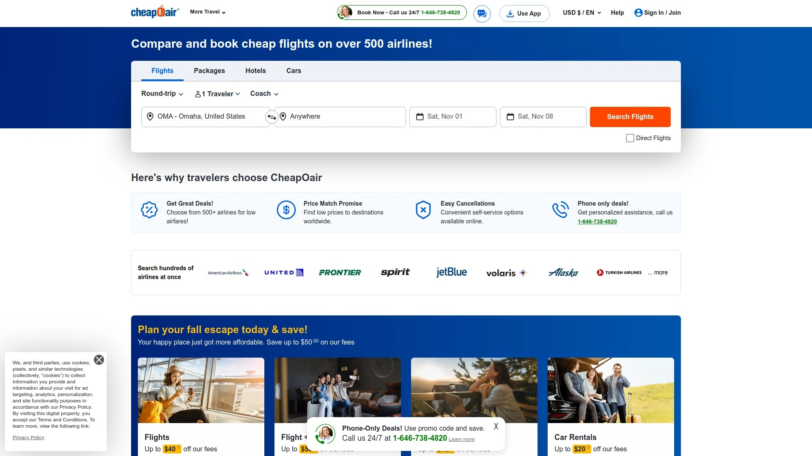

CheapOair positions itself as discount specialist through partnerships with over 450 airlines enabling exclusive deals unavailable through other platforms. The extensive airline network creates pricing advantages on certain routes where CheapOair's agreements yield better rates than competitors.

The platform covers flights, hotels, car rentals, and vacation packages through budget-focused lens. Search tools emphasize finding lowest prices through flexible date searching and multi-city routing options. Customer support provides assistance with booking changes and travel issues.

User reviews mention both positive experiences finding competitive prices and negative feedback regarding customer service and hidden fees. As with any budget platform, scrutinize total costs including taxes, fees, and add-on charges before assuming deals beat alternatives. Independent comparison remains crucial.

The platform works for price-focused travelers willing to navigate budget booking quirks for savings. Business travelers and those prioritizing service quality over lowest price might prefer premium platforms. Always compare CheapOair's final prices against airline direct bookings and other OTAs—exclusive deals sometimes deliver genuine savings, but not universally.

## **[OneTravel](https://onetravel.com)**

Discount travel agency offering reduced fares on flights, hotels, and vacation packages with emphasis on international routes.

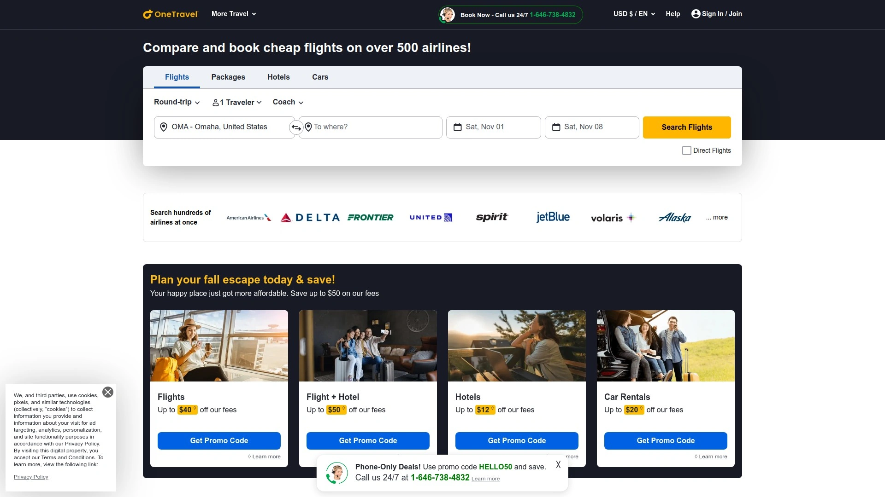

OneTravel targets budget-conscious travelers through discounted rates on flights, hotels, and bundled packages. The platform releases promotional codes regularly—$50 off international flights, percentage discounts on vacation packages, and seasonal sales during Black Friday, summer, and New Year periods create savings opportunities for flexible travelers.

First-time customer codes provide additional discounts for new users, ranging from $20-50 off initial bookings. The platform emphasizes international flight inventory where pricing remains competitive compared to larger OTAs. Multi-city search capabilities help travelers building complex itineraries find reasonable fares.

Reviews indicate mixed customer experiences—some find legitimate savings while others encounter service issues and hidden fees. The promotional code frequency creates deal-hunting opportunities for patient shoppers willing to wait for optimal timing. Customer support quality receives inconsistent feedback across review platforms.

OneTravel works best for international flight bookings and vacation packages during promotional periods. Domestic routes and last-minute bookings may not show pricing advantages over mainstream platforms. Always verify final prices including all fees against alternatives before assuming OneTravel delivers savings. For budget travelers targeting specific deals during sales windows, OneTravel provides monitoring value.

## **[Hostelworld](https://hostelworld.com)**

Hostel booking specialist featuring budget accommodations, shared dormitories, and social travel experiences for backpackers globally.

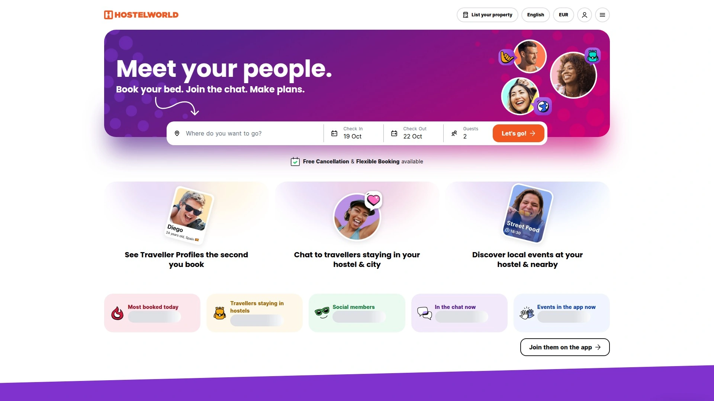

Hostelworld dominates hostel booking through comprehensive inventory of budget accommodations worldwide. The platform lists hostels offering dormitory beds, private rooms, and social spaces designed for backpacker culture. Detailed reviews from fellow budget travelers provide authentic insights into cleanliness, atmosphere, staff quality, and social scene.

Search filters sort by price, location, amenities, and guest ratings helping travelers find hostels matching preferences. Atmosphere tags identify party hostels versus quiet properties, enabling selection aligned with travel style. Booking fees apply to reservations, increasing total costs beyond nightly rates shown in search.

The community focus extends beyond accommodation into travel guides, packing advice, and destination information tailored to backpacker interests. The platform culture emphasizes solo travel, meeting fellow travelers, and budget exploration rather than luxury or privacy.

Hostelworld serves young travelers, backpackers, and anyone prioritizing budget over comfort. Families, business travelers, and those wanting private accommodations should look elsewhere. The platform's hostel specialization creates unmatched inventory depth in this niche—booking directly through hostels sometimes yields better rates, but Hostelworld's comprehensive search justifies small booking fees for convenience.

## **[Kiwi.com](https://kiwi.com)**

Innovative flight search platform using "travel hacks" including self-transfers, hidden cities ticketing, and Nomad multi-city routing.

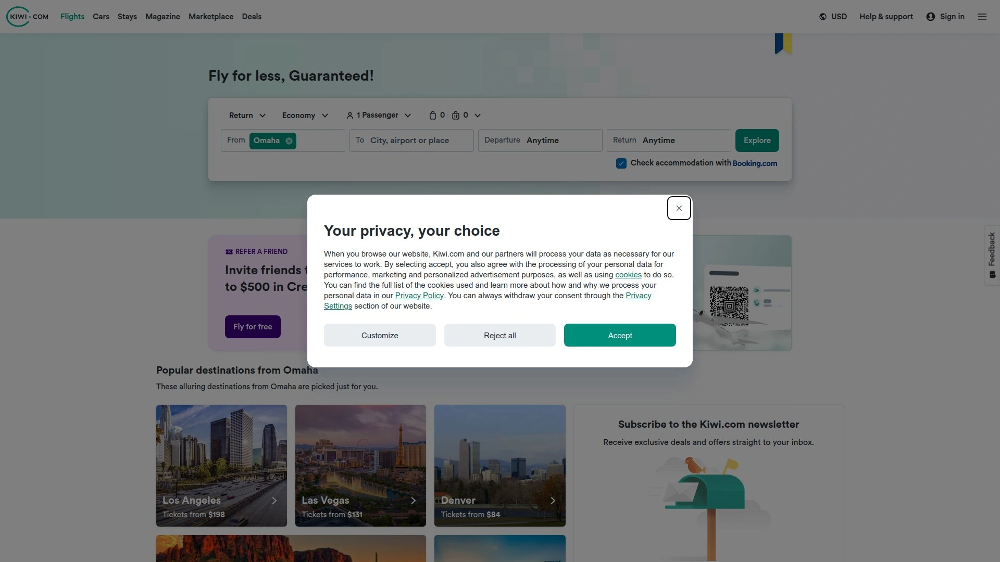

Kiwi.com differentiates through travel hacks unlocking flight combinations traditional platforms can't book. Self-transfer builds itineraries connecting flights that airlines don't partner on, accessing destinations most platforms can't reach. Hidden city ticketing beats direct flight prices by booking connections where you exit at layover cities. Throwaway ticketing exploits round-trip discounts when you only need one-way travel.

The Nomad feature calculates every possible route combination for multi-city trips, finding cheapest sequences for visiting multiple destinations in flexible order. This optimization exists exclusively on Kiwi.com. The "Search Anywhere" functionality shows cheapest destinations from your location for spontaneous travelers prioritizing price over specific destinations.

Flexible ticket options include Flexi, Standard, and Saver with varying rebooking and cancellation policies. Price alerts notify users when saved route fares drop. Custom filters enable detailed searching by airline, timeframe, airport radius, price range, and transport options.

The innovative approach creates opportunities but adds complexity and risk. Self-transfers require managing connections without airline responsibility if delays cause misses. Some airlines prohibit hidden city ticketing in their terms. Reviews mention both successful savings and problematic booking experiences. For adventurous travelers comfortable with unconventional booking risks for savings, Kiwi.com offers capabilities unavailable elsewhere.

## **[Trivago](https://trivago.com)**

Hotel price comparison site aggregating results from multiple booking platforms enabling side-by-side rate comparison.

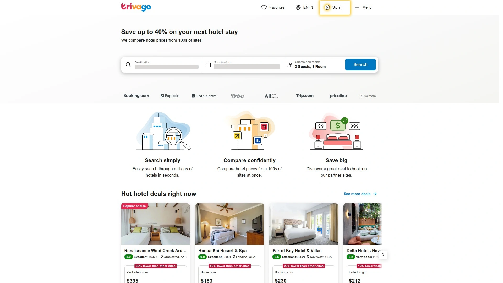

Trivago functions as metasearch engine displaying hotel prices from Expedia, Hotels.com, Booking.com, and other platforms side-by-side. The comparison approach helps travelers identify which booking site offers best rates for specific properties. Users can then click through to preferred platform for actual booking.

The interface emphasizes visual comparison with pricing displayed across multiple sources simultaneously. Reviews aggregate from various platforms providing comprehensive feedback perspective. Filter options cover standard hotel search criteria—location, price, amenities, and ratings.

Independent testing found Trivago delivering mixed results compared to other comparison engines—sometimes finding competitive rates, other times missing deals that HotelsCombined or Kayak discovered. The platform's value depends on which sources it searches for specific destinations and dates.

Trivago earns revenue through clicks to booking platforms, creating potential conflicts where higher-paying platforms might receive preferential positioning. Transparency around ranking factors remains limited. For travelers wanting quick visual price comparison, Trivago provides useful overview, though comprehensive deal hunting requires checking multiple comparison engines.

## **[HotelsCombined](https://hotelscombined.com)**

Hotel metasearch engine consistently finding lowest prices through comprehensive comparison across booking sites.

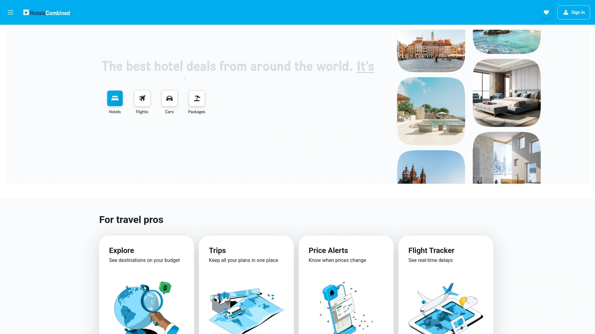

HotelsCombined earned reputation for consistently discovering cheapest hotel rates through exhaustive comparison across booking platforms. Independent testing comparing HotelsCombined against Orbitz, Trivago, and Kayak found HotelsCombined regularly identifying lowest prices both for last-minute and advance bookings.

Testing examples showed dramatic price differences—a Venice hotel listing at $151 on HotelsCombined versus $451 on Orbitz for comparable rooms. The platform searches broader range of booking sources including smaller regional sites that larger metasearch engines exclude. This comprehensive approach captures deals others miss.

The interface provides straightforward hotel searching without excessive complexity. Results display rates from multiple booking sites enabling quick comparison. Reviews aggregate from various sources helping travelers make informed decisions beyond just price.

As a metasearch engine, HotelsCombined redirects to booking platforms for transaction completion. The platform's strength lies in comprehensive source coverage rather than direct booking features. For travelers prioritizing absolute lowest price discovery over booking interface preferences, HotelsCombined delivers consistent value through exhaustive comparison.

## **[GetYourGuide](https://getyourguide.com)**

Activities and tours marketplace offering tickets to attractions, guided experiences, and local activities bookable online.

GetYourGuide specializes in tours, activities, and attraction tickets rather than transportation or accommodation. The platform lists skip-the-line museum tickets, guided city tours, adventure activities, food experiences, and unique local encounters bookable in advance. Coverage spans global destinations with particular depth in popular tourist cities.

Free cancellation on many activities provides flexibility for travelers whose plans change. Reviews from previous participants help assess tour quality and guide expertise. Detailed descriptions outline what's included, meeting points, duration, and what to bring. Mobile tickets simplify access without printing confirmations.

Booking activities in advance secures availability for popular attractions that sell out and enables itinerary planning. Prices typically match or slightly exceed booking directly with tour operators, with convenience justifying small premiums. The platform vets operators reducing risk of low-quality experiences though occasional disappointments occur.

GetYourGuide works for travelers wanting pre-planned activities rather than spontaneous exploration. The platform removes language barriers when booking foreign activities and consolidates confirmations into one account. For destination-heavy travel where tours and activities dominate itineraries, GetYourGuide simplifies activity planning and booking.

## **[Viator](https://viator.com)**

Tours and activities platform owned by TripAdvisor featuring global experiences with user reviews and flexible cancellation.

Viator operates under TripAdvisor ownership, leveraging review platform credibility for tours and activities marketplace. The platform lists guided tours, adventure activities, day trips, food experiences, and local encounters bookable online. Global coverage spans major tourist destinations and off-beaten-path locations.

Integration with TripAdvisor reviews provides transparency about tour quality and guide expertise. Many bookings include free cancellation up to 24 hours before activities, accommodating itinerary changes. Mobile booking and ticket access streamline experience logistics.

Activity variety ranges from mainstream museum tickets and city walking tours to unique local experiences like cooking classes and cultural immersions. Prices reflect marketplace positioning between direct operator booking and full-service tour companies. The TripAdvisor connection means activities with positive reviews appear prominently.

Viator suits travelers wanting planned activities with social proof through reviews. Spontaneous travelers preferring to discover local tours upon arrival save money and maintain flexibility by booking directly. The platform's value lies in pre-trip planning, review aggregation, and consolidated booking rather than unique inventory access.

## **[Lastminute.com](https://lastminute.com)**

Last-minute travel deals specialist offering reduced rates on flights, hotels, and packages for spontaneous trip planning.

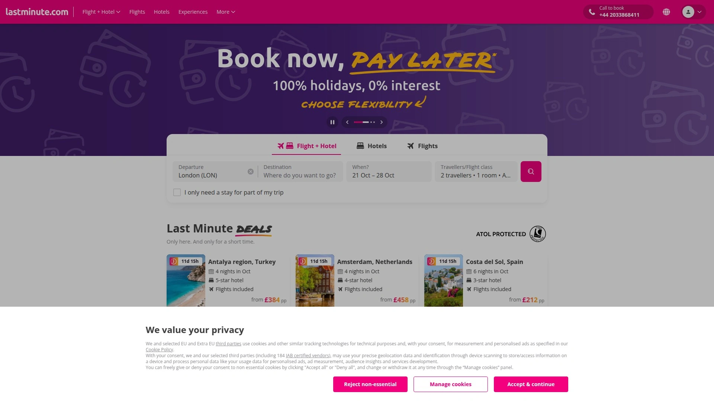

Lastminute.com targets spontaneous travelers through discounted rates on immediate-departure trips. The platform lists last-minute flight deals, hotel vacancies, vacation packages, and activities at reduced prices as departure dates approach. Suppliers discount unsold inventory rather than leaving it empty, creating opportunities for flexible travelers.

User reviews present mixed experiences—some travelers find legitimate savings while others encounter booking issues and customer service problems. The platform's reputation includes concerns about confirmation processing and refund handling that potential users should consider.

The last-minute specialization works for travelers with flexible schedules who can depart on short notice. Business travelers and those with fixed schedules gain limited value from last-minute inventory. Comparison shopping remains crucial as "last-minute deals" don't always beat advance booking prices.

Lastminute.com appeals to spontaneous adventurers and weekend warriors wanting quick getaways. Risk-averse travelers should investigate customer service reputation and booking reliability before committing to platform. The last-minute niche creates value for specific traveler profiles despite service inconsistencies.

## **[eDreams](https://edreams.net)**

European travel agency offering flights, hotels, and packages with Prime subscription service for travel benefits.

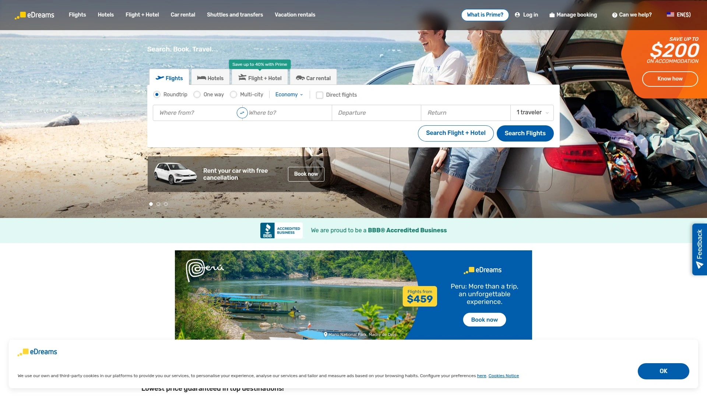

eDreams operates primarily in European markets offering flights, hotels, car rentals, and vacation packages. The platform caters to European travelers though international booking capabilities exist. Prime subscription service provides exclusive discounts, flexible booking, and priority customer support for frequent users.

Reviews indicate variable customer experiences ranging from smooth bookings to service frustrations. Customer support quality receives inconsistent feedback with some users praising resolution efforts while others report difficulties. The platform shares ownership with Opodo and Go Voyages under parent company creating overlapping inventory.

Pricing competitiveness varies by route and destination—sometimes matching or beating competitors, other times exceeding alternatives. Always compare final prices including fees before assuming eDreams offers best rates. The Prime subscription delivers value for users booking multiple trips annually but adds costs for occasional travelers.

eDreams works for European-based travelers familiar with the platform or finding competitive pricing on specific routes. International travelers have broader platform options potentially offering superior service and pricing. The subscription model suits frequent flyers while casual users should assess whether benefits justify costs.

## **[Opodo](https://opodo.com)**

Multi-service travel platform offering flights, hotels, and packages with focus on European markets and package deals.

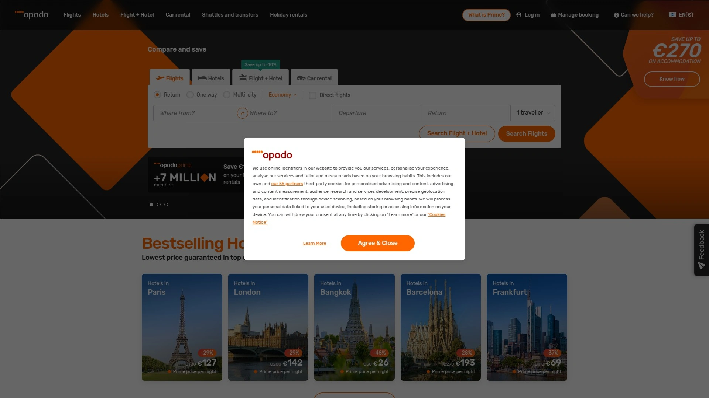

Opodo provides comprehensive travel booking across flights, hotels, car rentals, and vacation packages with European market emphasis. The platform operates under eDreams Odigeo parent company alongside sister brands eDreams and Go Voyages sharing infrastructure and inventory.

Customer reviews present polarized experiences—either highly positive praising efficient problem resolution and friendly service, or highly negative citing booking confirmation issues and excessive refund fees. Few reviews fall between extremes. Common complaints include charging customers without confirmation emails and applying large service fees to refunds.

Positive feedback highlights responsive human customer support once users bypass automated systems. Price reliability and booking transparency receive mixed assessments. The platform's relationship with eDreams Odigeo means comparing rates across sister sites sometimes reveals price variations for identical bookings.

Opodo suits European travelers who research thoroughly and understand cancellation policies before booking. The platform isn't automatically dismissible if prices beat alternatives, but the customer service inconsistency requires awareness. Reading terms and conditions prevents surprises if cancellations become necessary. Refunds reportedly take six months minimum with fees reducing amounts returned.

## FAQ

**Should I book directly with airlines and hotels or use booking platforms?**

Direct booking through airline and hotel websites often provides better flexibility for changes, guaranteed loyalty program credit, and occasionally matches or beats third-party prices through price-match guarantees. However, booking platforms aggregate options making comparison easier and sometimes offer exclusive rates or package discounts unavailable direct. For established loyalty program members with elite status, direct booking preserves benefits like upgrades and elite night credits that third-party bookings forfeit. Casual travelers prioritizing lowest price benefit from comparing both direct and platform pricing before committing.

**How do I actually find the cheapest prices when every site claims to be the best deal?**

Use metasearch engines like Google Flights, Kayak, and Skyscanner to compare across multiple booking sources simultaneously rather than checking individual sites. Start with Google Flights for fast searching and flexible date visualization, then verify findings on Kayak or Momondo which search additional OTAs Google excludes. For hotels, check HotelsCombined, Trivago, and Google Hotels for comprehensive rate comparison. Always verify final prices including all taxes and fees before booking—advertised rates sometimes exclude significant charges revealed only at checkout. Consider timing your bookings during sales periods and setting price alerts for monitored routes.

**What's the real difference between all these booking sites if many are owned by the same companies?**

Booking Holdings owns Booking.com, Priceline, Agoda, Kayak, and OpenTable while Expedia Group owns Expedia, Hotels.com, Vrbo, Hotwire, Orbitz, Travelocity, and Trivago. Despite shared ownership, platforms maintain separate inventory, pricing, and features—the same hotel room often costs different amounts across sister sites. Booking.com emphasizes Europe and global breadth, Agoda focuses on Asia, Priceline offers opaque deals, while Kayak functions as metasearch engine. Always compare across platforms even within the same corporate family as pricing and availability vary due to separate contracts and market positioning.

## Final Thoughts

Choosing among 25 travel booking platforms depends entirely on your specific trip—destination region, flexibility around dates and hotels, loyalty program involvement, and whether you prioritize convenience over absolute lowest price. **[Trip.com](https://trip.com)** delivers comprehensive one-platform booking particularly valuable for travelers whose itineraries include Asia-Pacific destinations where the platform's regional expertise, train booking integration, and responsive 24/7 customer support create advantages that Western-focused competitors can't match, while still providing competitive global coverage for flights, hotels, and activities worldwide.
